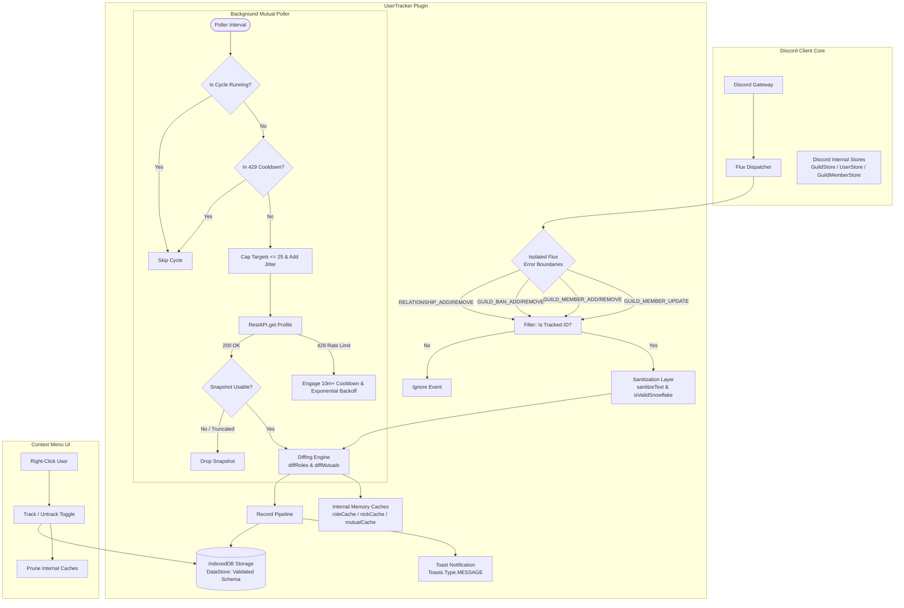
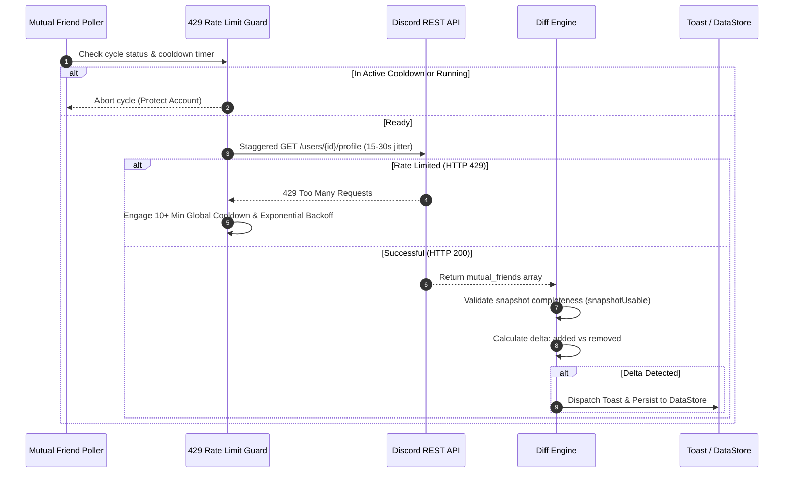

<div align="center">

# 🛰️ UserTracker
### High-Performance, Hardened User Monitoring & State Diffing Plugin for Vencord

[](https://www.gnu.org/licenses/gpl-3.0)
[](https://www.typescriptlang.org/)
[](https://vencord.dev)
[](tests/)
[-success?style=for-the-badge&logo=shield&logoColor=white)](#-security-hardening--api-safety)
[](CONTRIBUTING.md)

<p align="center">
  <b>UserTracker</b> is an enterprise-grade, client-side monitoring plugin for <a href="https://vencord.dev">Vencord</a>. It passively observes member events across mutual Discord servers, accurately computes delta changes (roles, nicknames, guild presence, and friendships), and presents notifications with zero webpack patching or token scraping.
</p>

---

[About](#-about-usertracker) •
[Architecture](#-system-architecture) •
[Key Features](#-key-features) •
[Security & Hardening](#-security-hardening--api-safety) •
[Installation](#-installation) •
[Configuration](#-configuration-reference) •
[Verification](#-testing--quality-assurance) •
[Contributing](#-contributing) •
[License](#-license)

---

</div>

## 📖 About UserTracker

In large Discord communities and shared networks, keeping track of member changes—such as role escalations, nickname alterations, server exits, or friendship status—usually requires reviewing audit logs or running external server bots. 

**UserTracker** brings real-time, cross-server visibility directly to your client without requiring administrator privileges or running bots:
- **Zero Scraping & Zero Tokens:** Operates strictly on Flux dispatcher events already delivered to your Discord client.
- **Client Safety First:** Built with aggressive rate-limit shields (HTTP 429 detection, global cooldowns, target capping, and jitter) to protect your account.
- **Pure Memory Resilience:** All untracked targets are automatically pruned from internal caches to guarantee zero memory leakage during long client uptimes.
- **Data Integrity:** Employs runtime schema validation and string sanitization (blocking bidi-overrides, zero-width characters, and control codes) to prevent UI spoofing.

---

## 🏛 System Architecture

The following diagram illustrates how UserTracker ingests events from Discord's internal Flux Dispatcher, processes them through validation and rate-limiting barriers, and persists state across restarts.



### Mutual-Friend Polling Lifecycle & 429 Defense



---

## ✨ Key Features

| Feature | Description | Status |
| :--- | :--- | :---: |
| 📋 **Multi-User Watchlist** | Track arbitrary numbers of users across all mutual guilds by Discord Snowflake ID. | ✅ Active |
| 🎭 **Role Delta Diffing** | Computes additions and removals (`+Admin, -Mod`) resolving human-readable names. | ✅ Active |
| 💬 **Nickname Monitoring** | Detects nickname alterations per guild with sanitized string normalization. | ✅ Active |
| 👋 **Guild Presence** | Tracks joins, leaves, and kicks (*"left or was removed"*), as well as bans and unbans. | ✅ Active |
| 🤝 **Direct Relationships** | Real-time alerts for friend requests, accepted requests, unfriending, and blocks. | ✅ Active |
| 👥 **Mutual Friend Polling** | Optional background poller detecting friend changes between tracked targets and mutual friends. | ⚙️ Opt-in |
| 🖱️ **Context Menu Integration** | One-click **Track / Untrack user** directly from Discord's native right-click menu. | ✅ Active |
| 🛡️ **HTTP 429 Shield** | Automated circuit breaker that freezes polling on rate-limits to prevent account strikes. | ✅ Active |
| 🧹 **Memory Pruning** | Automatic purge of cached metadata whenever a user is untracked. | ✅ Active |

---

## 🛡️ Security Hardening & API Safety

UserTracker is engineered with defense-in-depth principles:

### 1. Discord API & Account Safety
- **HTTP 429 Shield:** Inspects API error responses. If a `429` status code or rate-limit message is received, a global cooldown is triggered immediately (minimum 10 minutes) alongside exponential backoff multipliers.
- **Target Capping:** Mutual friend queries are strictly capped at 25 targets per cycle to avoid generating high-frequency request bursts.
- **Request Jitter:** Requests are staggered with 15–30 second randomized delays.
- **Concurrency Locking:** Polling cycles are guarded by atomic execution flags to prevent cycle stacking on slow networks.

### 2. Runtime & Dispatcher Resilience
- **Isolated Error Boundaries:** Every Flux dispatch listener (`GUILD_MEMBER_UPDATE`, `GUILD_BAN_ADD`, etc.) is wrapped in defensive `try...catch` boundaries, preventing any malformed Discord payload from crashing Discord's internal event loop.
- **Safe Store Fallbacks:** All Discord store accessors (`GuildStore`, `GuildMemberStore`, `UserStore`) provide graceful fallbacks if stores are uninitialized or cold.

### 3. Data Integrity & Injection Defense
- **Strict Snowflake Validation:** Enforces `/^\d{17,20}$/` on all target IDs and mutual relationships.
- **DataStore Type Guards:** Validates both `UserTracker_history` and `UserTracker_mutuals` schemas on startup to safely discard corrupted or tampered records from IndexedDB.
- **String Sanitization:** All user tags, guild names, and role labels are sanitized through `sanitizeText()` to strip:
  - ASCII control characters (`\x00`–`\x1F`, `\x7F`)
  - Bidirectional override characters (e.g. `\u202E`) to prevent text-spoofing
  - Zero-width spaces (`\u200B`–`\u200D`, `\uFEFF`)
  - Line-break normalization and length clamping

---

## 🚀 Installation

> [!IMPORTANT]
> UserTracker requires a **Vencord source build** because the stock Vencord installer cannot load custom third-party userplugins.

### Prerequisites
- **Node.js**: v20.0.0 or later (`node -v`)
- **pnpm**: v9.0.0 or later (`brew install pnpm` or `corepack enable`)
- **Git**: Installed and configured

### Quickstart (3 Minutes)

```bash
# 1. Clone Vencord from source (if not already cloned)
git clone https://github.com/Vendicated/Vencord.git ~/Vencord
cd ~/Vencord
pnpm install

# 2. Copy userTracker into Vencord's userplugins folder
mkdir -p src/userplugins
cp -r /Volumes/Shared/PW/user-tracker/src/userplugins/userTracker src/userplugins/userTracker

# 3. Build Vencord with UserTracker bundled
pnpm build

# 4. Point Discord's Vencord patch to your new build
# (On macOS, Discord loads from ~/Library/Application Support/Vencord/dist)
rm -rf "$HOME/Library/Application Support/Vencord/dist"
ln -s "$HOME/Vencord/dist" "$HOME/Library/Application Support/Vencord/dist"

# 5. Reload Discord
# Press Cmd + R (or Ctrl + R) inside Discord
```

Once reloaded, navigate to:
**User Settings (⚙️) → Vencord → Plugins → Search "UserTracker" → Enable**.

---

## ⚙️ Configuration Reference

| Option | Type | Default | Description |
| :--- | :---: | :---: | :--- |
| `trackedIds` | `STRING` | `""` | Comma, space, or newline-separated Discord Snowflake IDs to monitor (up to 25 recommended if mutual watching is enabled). |
| `trackRoles` | `BOOLEAN` | `true` | Notify on role additions and removals with resolved role names. |
| `trackNick` | `BOOLEAN` | `true` | Notify on guild nickname changes. |
| `trackJoin` | `BOOLEAN` | `true` | Notify when a tracked user joins a shared server. |
| `trackLeave` | `BOOLEAN` | `true` | Notify when a user leaves or is removed/kicked from a server. |
| `trackBan` | `BOOLEAN` | `true` | Notify on ban and unban events. |
| `trackRelationship` | `BOOLEAN` | `true` | Notify when a tracked user friends, unfriends, requests, or blocks you. |
| `showToast` | `BOOLEAN` | `true` | Display native toast popups on events (history always records). |
| `historyLimit` | `NUMBER` | `200` | Maximum number of history entries retained in storage (1–1000). |
| `watchMutualFriends` | `BOOLEAN` | `false` | Enable periodic background polling of mutual-friends lists among your mutuals. |
| `mutualCheckMinutes`| `SELECT` | `60` | Polling frequency for mutual friends (`15`, `30`, `60`, or `120` minutes). |

---

## 🧪 Testing & Quality Assurance

UserTracker maintains a comprehensive test suite executed with Node's native test runner (zero external dependencies).

```bash
# Run the complete test suite
node --test tests/*.test.ts
```

### Test Coverage Highlights
- **`tests/userTracker.utils.test.ts` (20 Tests):** Snowflake validation, input sanitization, control-character stripping, bidi-override neutralization, history trimming boundaries, entry schema verification, and role diffing.
- **`tests/userTracker.mutuals.test.ts` (15 Tests):** HTTP 429 status detection, exponential backoff curves, global cooldown periods, snapshot usability guards, and mutual target capping.

---

## 📁 Repository Structure

```
user-tracker/
├── src/
│   └── userplugins/
│       └── userTracker/
│           ├── index.ts        # Vencord plugin lifecycle, Flux hooks & settings
│           ├── utils.ts        # Pure logic: validation, sanitization, diffing
│           ├── mutuals.ts      # Mutual-friend polling, 429 shield & backoff
│           └── README.md       # Plugin-specific documentation
├── tests/
│   ├── userTracker.utils.test.ts    # Unit tests for utils & sanitization
│   └── userTracker.mutuals.test.ts  # Unit tests for mutuals & rate limiting
├── docs/
│   └── superpowers/            # Architectural specifications & execution plans
├── .gitignore                  # Git ignore rules
└── README.md                   # Main documentation
```

---

## 🤝 Contributing

Contributions are welcome! Please follow these guidelines:
1. **Fork the repository** and create a feature branch (`git checkout -b feature/my-feature`).
2. **Ensure all tests pass** using `node --test tests/*.test.ts`.
3. **Follow TDD** when adding new features or fixing bugs.
4. **Submit a Pull Request** with a clear explanation of your changes.

---

## 📄 License

This project is licensed under the **GNU General Public License v3.0 (GPL-3.0)** — matching the license of [Vencord](https://vencord.dev). See the [LICENSE](LICENSE) file for details.
